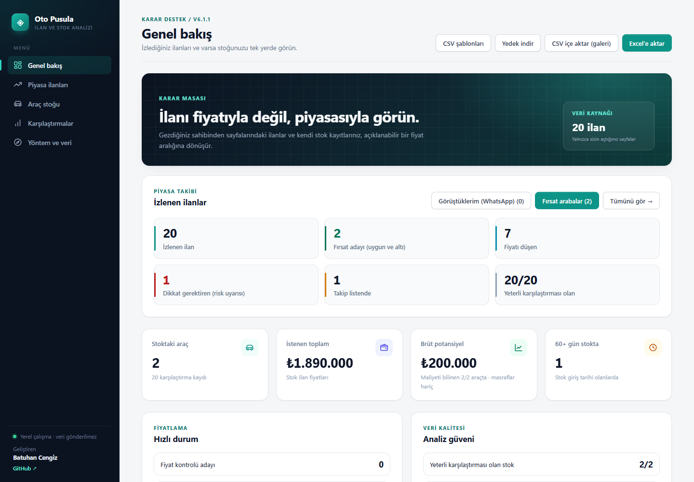
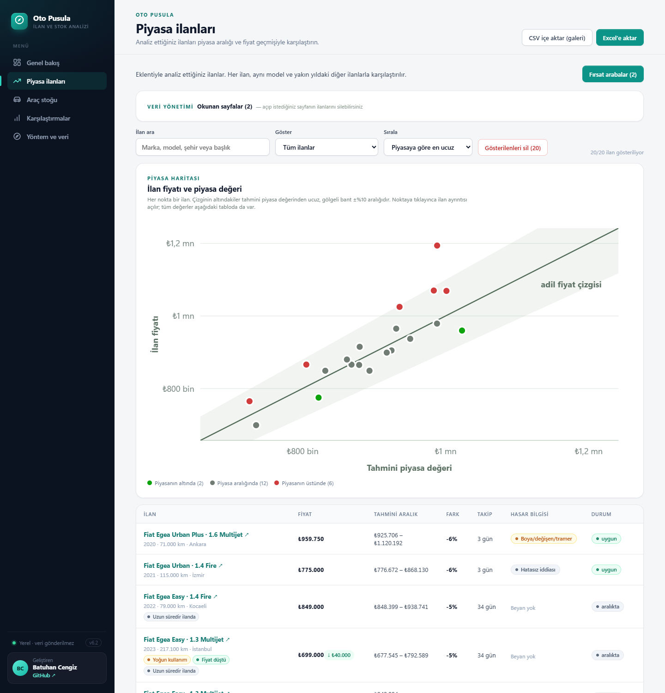
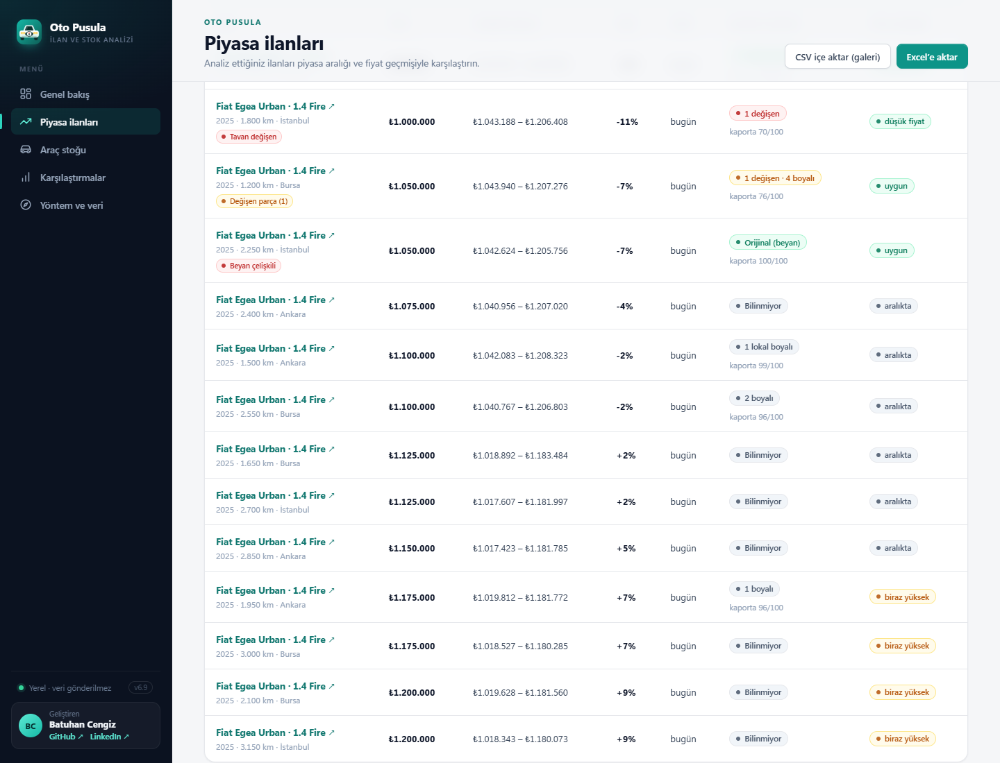
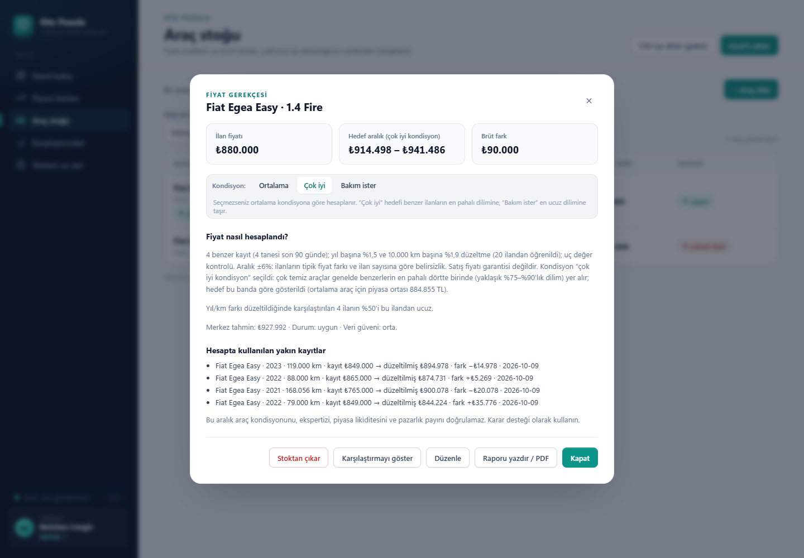
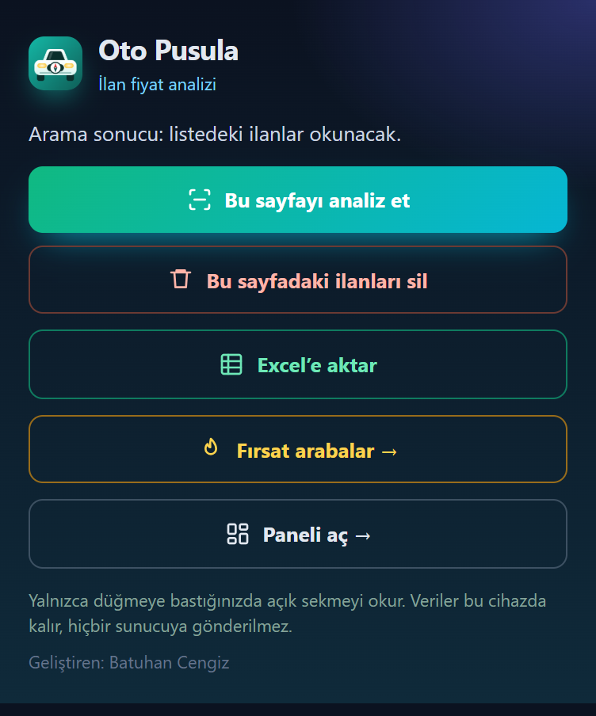
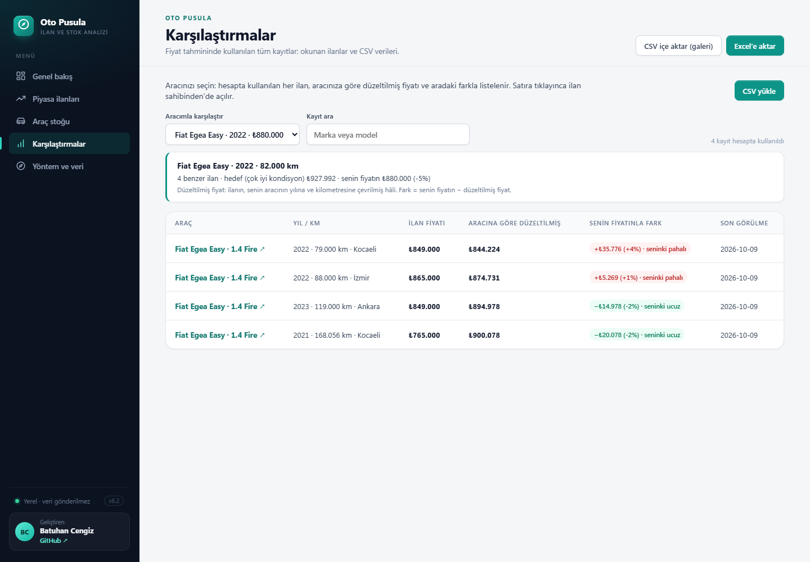
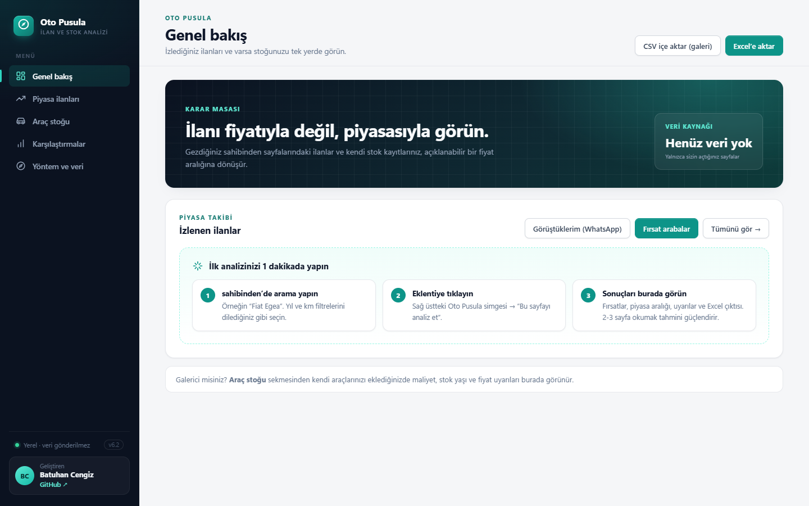

# Oto Pusula

[](https://github.com/batucengiz/oto-pusula/actions/workflows/test.yml) [](https://github.com/batucengiz/oto-pusula/releases/latest)  

İkinci el araç ilanlarının fiyatını, aynı modelin piyasasıyla karşılaştıran bir Chrome eklentisi.

**Kimler için:** Araç almak isteyen biri "bu ilan pahalı mı?" sorusuna cevap arar. Galerici ise stoğunu piyasayla karşılaştırıp hangi aracın fiyatını gözden geçireceğine karar verir.

**Öne çıkanlar:** sahibinden.com'daki **bütün marka ve modeller** (marka ve seri sayfanın gezinme yolundan ve tablo sütunlarından okunur) · benzer araç eşleştirme ve öğrenen fiyat modeli · ilan sayfasındaki boya/değişen şemasından **parça bazlı kaporta puanı** (fiyattan ayrı) · çelişkili ve sonradan değişen satıcı beyanı uyarısı · fiyat geçmişi ve fırsat listesi · tek tıkla Excel · veri bilgisayardan çıkmaz.

**[Son sürümü indir](https://github.com/batucengiz/oto-pusula/releases/latest)** · Chrome, Edge, Brave, Opera (masaüstü)

## Ekran görüntüleri

**Genel bakış:** izlenen ilanlar, fırsat ve risk sayıları, stok özeti



**Piyasa ilanları:** her ilanın fiyatı ile tahmini piyasa değeri (piyasa haritası), durum ve uyarılar



**Kaporta durumu:** satıcının boya/değişen şemasından parça parça okunur; kaporta puanı fiyat durumundan ayrı gösterilir, çelişkili beyan ve tavan değişeni işaretlenir



<table>
<tr>
<td width="68%"><b>Fiyat gerekçesi:</b> kondisyon seçimi, hesabın nasıl yapıldığı, karşılaştırılan ilanlar ve fark<br><br></td>
<td width="32%"><b>Eklenti penceresi:</b> sahibinden sayfasında tek tıkla analiz, silme, Excel<br><br></td>
</tr>
</table>

**Aracımla karşılaştır:** satmak istediğiniz aracın her benzer ilanla farkı; satıra tıklayınca ilan açılır



**İlk açılış:** veri yokken adım adım başlangıç rehberi



<sub>Ekran görüntüleri yalnızca tanıtım için oluşturulmuş örnek kayıtlarla alınmıştır; eklentide örnek veri bulunmaz, panel kullanıcının kendi analiz ettiği ilanlarla dolar.</sub>

## Ne yapar?

- **Sayfa analizi:** sahibinden.com'da bir arama sonucu ya da ilan sayfasındayken eklenti simgesine tıklayıp **Bu sayfayı analiz et** dersiniz. Listedeki ilanlar okunur, marka, model, motor, paket ve kasa tipi başlıktan çıkarılır.
- **Piyasa aralığı:** Her ilan aynı model ve yakın yıldaki diğer ilanlarla karşılaştırılır. Yıl ve km farkı düzeltilir, uç değerler ayıklanır. Sonuç olarak ortanca fiyat, tahmini aralık ve güven düzeyi üretilir. Durum beş kademelidir: düşük fiyat, uygun, aralıkta, biraz yüksek, yüksek fiyat.
- **Veriden öğrenen fiyat modeli:** Aynı modelden en az 12 ilan biriktiğinde, yıl ve km başına değer kaybı ile motor/paket/kasa etkileri bu ilanlardan regresyonla öğrenilir. Benzer ilan azsa tahmini bu model yapar ve bunu açıkça belirtir.
- **Alıcı uyarıları ve pazarlık önerisi:** Yılda ~35 bin km'den fazla kullanım (taksi/kiralık olabilir), piyasanın %20+ altında "şüpheli ucuz" ilan (dolandırıcılık/gizli hasar uyarısı), fiyatı düşen ve uzun süredir yayında olan ilanlar işaretlenir. Açılış teklifi ve hedef fiyat önerilir.
- **WhatsApp’tan yaz:** İlan detay sayfasında “Telefonu göster”e kendiniz bastıktan sonra analiz ederseniz, popup o ilana özel hazır mesajla WhatsApp’ı açar; mesajı siz düzenleyip gönderirsiniz. İsterseniz “Numarayı kaydet” ile numara yalnızca o ilana yazılır, ilan takip listesine alınır ve Excel çıktısında görünür; panelden tek tuşla silinir. Eklenti numarayı göstermek için hiçbir şeye tıklamaz, onayınız olmadan numara saklamaz, toplu mesaj göndermez.
- **Fırsat arabalar:** Tek tuşla piyasanın altındaki (uygun ve düşük fiyatlı, ağır hasarsız) ilanlar **fırsat puanına** göre listelenir. Popup ve panelden erişilir.
- **Fırsat puanı (0–100):** Fiyat, kaporta ve satıcı beyanı tek sıralamada birleşir: piyasaya göre fiyat 60 puan (piyasanın %15+ altı tam puan), kaporta 25 puan (orijinal 25, kaporta puanındaki her eksik puan için -0,5; ör. 3 değişen kapı 13; şema okunmadıysa 10), satıcı tipi ("Kimden": yetkili bayi 6, sahibinden 5, galeri 4) ve tutarlı beyan (çelişki yok, sonradan değişmemiş) 15 puan. Fiyat güveni "orta" ise ×0,9, yoğun kullanımda -5, takipte fiyatı düşende +3. Etiketler: 80+ çok iyi fırsat, 65–79 iyi fırsat, 50–64 makul (yalnızca fırsat adaylarında). Böylece daha ucuz ama değişenli bir araç, biraz pahalı ama temiz bir aracın önüne geçmez. Ağır hasarlı, tavanı değişen ve az verili ilanlar puanlanmaz. Fiyat durumu ve kaporta puanı ayrı gösterilmeye devam eder.
- **Veri yönetimi:** Her analiz edilen sayfa “Okunan sayfalar” listesine girer; istenen sayfanın ilanları tek tuşla silinir (başka sayfada da görünen ilanlar kalır). Arama/filtreyle daraltılan ilanlar “Gösterilenleri sil” ile, 30+ gündür görülmeyen eski ilanlar ayrı filtreyle temizlenir. Toplu silmede takip listesindeki (★, numarası kayıtlı) ilanlar için ayrıca sorulur; istenirse onlar da silinir.
- **Görüştüklerim:** Numarasını kaydettiğiniz ilanlar panelde alt alta, her satırda WhatsApp düğmesiyle listelenir. Numaralar toplu çekilmez; her biri kullanıcının kendi açtığı ilandan, onayıyla gelir.
- **Popup’tan sayfa silme:** Silmek istediğiniz sahibinden sayfasını açıp popup’ta “Bu sayfadaki ilanları sil” dersiniz; ilk basış kaç ilanın silineceğini gösterir, ikincisi siler. Ne zaman toplanmış olursa olsun o sayfadaki ilanlar silinir, takip listesindekiler korunur.
- **Takip listesi:** İlgilendiğiniz ilanları yıldızlayıp ayrıca filtreleyebilirsiniz; ilan tekrar okunduğunda işaret korunur.
- **Piyasa haritası ve fiyat grafiği:** Her ilan, fiyatı ile tahmini piyasa değerini karşılaştıran bir grafikte nokta olarak görünür (adil fiyat çizgisi ve ±%10 bandıyla). İlan detayında fiyatın zaman içindeki değişimi çizilir. Grafikler bağımlılıksız SVG'dir.
- **Fiyat geçmişi:** Aynı ilanı sonraki günlerde tekrar gördüğünüzde fiyat değişimi kaydedilir. "Fiyatı düşenler" ve "en uzun süredir yayında" filtreleri pazarlıkta işe yarar.
- **Kaportası okunmamış fırsatı aç:** Piyasa ilanlarındaki düğme, her basışta kaportası henüz okunmamış en ucuz fırsatı yeni sekmede açar; orada eklentiye basınca kaporta puanı panele eklenir. Sayfalar kullanıcının hızında tek tek açılır (dakikada en fazla 6), eklenti kendi kendine gezinmez.
- **Kaporta durumu (parça parça):** İlan sayfasını açıp analiz ettiğinizde, satıcının doldurduğu boya/değişen şeması okunur: değişen, boyalı ve lokal boyalı parçalar ayrı ayrı listelenir, 100 üzerinden **kaporta puanı** verilir. Kaporta puanı fiyat değerlendirmesinden **ayrı** tutulur ("uygun fiyat" ile "temiz kaporta" iki ayrı soru). Tavanı değişen araçlar fırsat listesinden çıkarılır. Şema ile ilan metni çelişiyorsa (şemada her şey orijinal ama açıklamada "boyalı" geçiyor gibi) **"Beyan çelişkili"** uyarısı çıkar. Şeması okunmamış ilan temiz sayılmaz. Bu bilgi satıcı beyanıdır, ekspertiz yerine geçmez.
- **Hasar bilgisi:** İlan detayındaki yapısal "Ağır Hasar Kayıtlı" alanı ile başlık ve satıcı açıklamasındaki "boyalı", "tramer", "ağır hasar kayıtlı" gibi ifadeler sınıflandırılır. "Değişen yok" gibi olumsuz ifadeler ayırt edilir. Ağır hasar beyanlı ilanlar karşılaştırma havuzuna alınmaz, böylece piyasa fiyatını aşağı çekmez.
- **Kondisyon seçimi (isteğe bağlı):** Stok aracının detayında “Ortalama / Çok iyi / Bakım ister” seçilebilir. Seçilmezse hesap değişmez; “Çok iyi” hedefi benzer ilanların fiyat dağılımındaki üst dilime (yaklaşık %75–%90), “Bakım ister” alt dilime taşır.
- **Aracımla karşılaştır:** Karşılaştırmalar sekmesi stokta araç varsa otomatik olarak onunla açılır; hesapta kullanılan her ilan, aracın yılına/km’sine göre düzeltilmiş fiyatı ve aracın fiyatıyla farkı ile listelenir. Satıra tıklayınca ilan sahibinden’de açılır.
- **Galeri modu:** Stok CSV'si (alış maliyeti, stoğa giriş tarihi) yüklenir. Maliyet altı ilanlar, 60 günü geçen araçlar ve piyasaya göre pahalı kalan araçlar önceliklendirilir.
- **Tek tıkla Excel:** Popup veya panelden “Excel’e aktar” gerçek bir .xlsx indirir: kalın başlıklar, sayı biçimli fiyatlar, filtre, fırsatlar üstte; ilk sütunda ve başlıkta her ilan için tıklanabilir sahibinden bağlantısı. Dosya bağımlılıksız üretilir (xlsx.js). Tüm veri JSON yedek olarak alınıp geri yüklenebilir.

## Kurulum

1. Chrome'da `chrome://extensions` adresini açın, **Geliştirici modu**nu açın, **Paketlenmemiş öğe yükle** ile bu klasörü seçin.
2. sahibinden.com'da bir araç arama sonucu açın, eklenti simgesinden **Bu sayfayı analiz et** deyin.
3. Aynı modelin birkaç sayfasını analiz ettikçe tahminler güçlenir (aynı model için en az 4 benzer ilan gerekir). **Paneli aç** ile tüm sonuçları görün.

Projede örnek veya kurgusal veri yoktur: panel boş açılır ve yalnızca sizin analiz ettiğiniz gerçek ilanlarla, kendi stok kayıtlarınızla dolar.

### Başkasına kurmak (arkadaş, galeri)

1. GitHub’daki [Sürümler](https://github.com/batucengiz/oto-pusula/releases/latest) sayfasından en son **oto-pusula-<sürüm>.zip** dosyasını indirin.
2. Zip’i bir klasöre çıkarın; içindeki **KURULUM.txt** adımlarını izleyin (chrome://extensions → Geliştirici modu → Paketlenmemiş öğe yükle).
3. Her kullanıcının verisi kendi tarayıcısında ayrı tutulur. Paylaşmak için Excel’e aktar veya JSON yedek kullanılabilir.

Chrome ile aynı altyapıyı kullanan **Edge, Brave ve Opera** masaüstü tarayıcılarında da çalışır. Telefon tarayıcıları eklenti desteklemediği için mobilde çalışmaz.

Yeni paket üretmek için: `npm run package` → `dist/oto-pusula-<sürüm>.zip`

## Mimari

```
popup.js ──executeScript──▶ extract.js   (yalnızca açık sekmede, salt okunur, ham metin toplar)
    │
    ▼
listing.js  (DOM'dan bağımsız: ham metin → araç kaydı; marka/model/motor, hasar beyanı)
    │
    ▼
core.js     (fiyat motoru: eşleştirme, düzeltme, ortanca/aralık, güven; fiyat geçmişi birleştirme)
    │
    ▼
store.js ◀── dashboard.js  (panel: piyasa, stok, karşılaştırmalar; storage olayıyla canlı güncellenir)
```

**Tasarım kararları**

- **DOM katmanı ince tutuldu.** `extract.js` yalnızca seçicilerle metin toplar. Tüm yorumlama `listing.js` içindeki saf fonksiyonlarda yapılır. Bu sayede ayrıştırma mantığı tarayıcı olmadan test edilebilir, site yapısı değişirse yalnızca tek bir dosya güncellenir.
- **Açıklanabilir tahmin.** Kara kutu yerine, hangi ilanların hangi düzeltmeyle kullanıldığı detay penceresinde gösterilir. Az örnek, eski veri veya geniş dağılım güven düzeyini düşürür, "az veri" durumunda fırsat etiketi verilmez.
- **İki katmanlı tahmin.** Önce açıklanabilir "benzer ilan" yöntemi denenir; düzeltme oranları sabit varsayım yerine log-fiyat üzerinde ridge regresyonla veriden öğrenilir. Benzer ilan yetmezse aynı regresyon modeli doğrudan tahmin yapar. Model, fiziksel olarak anlamsız katsayı çıkarırsa (ör. eski araç daha pahalı) kullanılmaz. Sentetik piyasa testleri, modelin bilinen değer kaybı oranlarını geri bulduğunu doğrular.
- **Kademeli eşleştirme.** Önce aynı motor, paket ve kasa tipindeki ilanlar aranır. Yeterli ilan yoksa sırasıyla paket ve kasa tipi gevşetilir, motor/yakıt/vites asla gevşetilmez. Gevşetme yapıldıysa güven düzeyi düşürülür ve gerekçede yazılır.
- **Bağlama duyarlı ayrıştırma.** Model aramasında önce marka bulunur. Markasız metinlerde "2008" gibi model adları yıl sanılmaz. Motor hacmi ararken fiyattaki "1.300.000" ifadesi "1.3" ile karıştırılmaz.

## Neden ban riski düşük?

sahibinden 2024'te, ilan sayfasına kendi panelini ekleyen bir fiyat geçmişi eklentisinin kullanıcılarının girişini geçici olarak engelledi ([Webtekno](https://www.webtekno.com/sahibinden-com-fiyat-gecmisi-eklentisi-engelledi-h145720.html)). Oto Pusula bu yüzden farklı tasarlandı ve bu kurallar testlerle korunuyor:

- Sayfaya hiçbir şey eklemez veya değiştirmez; okuyucu (`extract.js`) salt okunurdur.
- Arka planda ya da kendiliğinden çalışan kod yoktur (içerik betiği, arka plan betiği yok); yalnızca düğmeye basınca bir kez çalışır.
- Sitenin yoklayabileceği eklenti dosyası (`web_accessible_resources`) ve siteyle iletişim kanalı yoktur.
- sahibinden'e veya başka bir sunucuya istek atmaz, veri göndermez, otomatik gezinmez, "Telefonu göster" gibi düğmelere basmaz.

Yine de sitenin iç sistemleri bilinemez; tam garanti verilemez. Önerilen kullanım: normal hızda gezinmek ve mümkünse hesaba giriş yapmadan kullanmak.

## Spam ve kötüye kullanım koruması

Eklenti yoğun kullanılsa bile (ör. bir galeride) kullanıcının WhatsApp veya sahibinden hesabını riske atmaması için sınırlar ürünün içindedir:

| Koruma | Sınır |
|---|---|
| Yeni satıcıya WhatsApp | İki yeni satıcı arasında en az 1 dakika; 10 dakikada en fazla 5, 24 saatte en fazla 20 |
| Aynı satıcıyla tekrar yazışma | Serbest, sayaca eklenmez |
| Satıcı numarası kaydetme | 24 saatte en fazla 30 (toplu numara toplamayı önler) |
| Hızlı gezinme | 2 dakikada 8+ sayfa analizinde "yavaşlayın" uyarısı |

Sayaçlar "Yerel verileri temizle" ve yedek geri yükleme ile sıfırlanmaz. Yazışma kaydında telefon numarası tutulmaz; yalnızca hangi ilanın satıcısına ne zaman yazıldığı tutulur.

Ticari kullanımda (galeri) satıcı numaralarının saklanması kişisel veri işlemedir; KVKK yükümlülükleri kullanıcıya aittir. Eklenti toplu mesaj göndermez, mesajı her seferinde kullanıcı gönderir.

## Güvenlik ve sınırlar

- İzinler yalnızca `activeTab` ve `scripting`. Eklenti sadece kullanıcı düğmeye bastığında, o anki sekmeye bir kez erişir. Arka plan betiği, içerik betiği veya kalıcı site izni yoktur.
- Eklenti hiçbir siteye kendisi istek atmaz, otomatik gezinme veya toplu tarama yapmaz. Sunucu yoktur, veri cihazdan çıkmaz.
- Harici kütüphane veya uzak betik yoktur. İçe aktarılan metin HTML olarak çalıştırılmaz, sadece `https://www.sahibinden.com/ilan/...` bağlantıları saklanır. CSV dışa aktarmada formül enjeksiyonu engellenir. Bu kurallar testlerle denetlenir.
- Sonuçlar ekspertiz, resmi değerleme veya satış fiyatı garantisi değildir. Hasar bilgisi satıcının beyanıdır.
- Kişisel kullanım içindir. Toplanan verileri yeniden yayınlamayın ve sitenin kullanım koşullarına uyun.
- Seçiciler sahibinden.com'un sayfa yapısına bağlıdır. Site değişirse `extract.js` güncellenmelidir.
- **Kapasite:** En fazla 5.000 ilan saklanır; panel 5.000 ilanla yaklaşık 1 saniyede açılır. Her tahmin, yıl ve km olarak en yakın 120 benzer ilanla yapılır. Tarayıcı deposu (~5 milyon karakter) dolarsa takipte olmayan ve numarası kaydedilmemiş, en uzun süredir görülmeyen ilanlar silinerek yeni analize yer açılır ve bu açıkça bildirilir.
- Ayrıntılı gizlilik politikası: [docs/GIZLILIK.md](docs/GIZLILIK.md)

## Geliştirme

```bash
npm test        # 99 test: fırsat puanı, gerçek sayfalarla uçtan uca yolculuk, performans (5.000 ilan) ve depo dolması, kaporta şeması okuma, puanlama ve beyan değişikliği, dayanıklılık (bozuk/rastgele girdi), fiyat motoru ve öğrenen model, ilan ayrıştırma, hasar beyanı, uyarılar, panel, popup/WhatsApp akışı, güvenlik ve ban kuralları
npm run verify-page -- "fixtures/sayfa.html"   # kaydedilmiş gerçek sayfayı okuyucudan geçirir
npm run dev     # paneli http://127.0.0.1:4173 adresinde önizler (popup için eklenti olarak yükleyin)
```

Eklentinin çalışma zamanı bağımlılığı yoktur. Geliştirme için Node.js 20+ ve `npm install` (yalnızca doğrulama aracı için jsdom) yeterlidir. `legacy/` klasörü ilk prototipi saklar ve eklenti tarafından yüklenmez.

### Gerçek sayfa doğrulaması

sahibinden sayfa yapısını değiştirdiğinde okuyucunun bozulup bozulmadığı, kaydedilmiş bir sayfa ile kontrol edilir:

1. Chrome'da bir arama sonucu veya ilan sayfası açın (telefon okumasını denemek için önce "Telefonu göster"e basın).
2. **Ctrl+S → "Web sayfası, Tamamı"** ile `fixtures/` klasörüne kaydedin.
3. `npm run verify-page -- "fixtures/sayfa.html"` raporu okunan/atlanan alanları gösterir; `npm test` de bu sayfaları otomatik dener.

Sayfanın kendi betikleri çalıştırılmaz, ağ isteği yapılmaz. `fixtures/` depoya gönderilmez (site içeriği ve satıcı bilgisi içerir).

## Yol haritası

- Tamamen orijinal ve boş şemalı ilan sayfalarıyla kaporta okuyucusunun gerçek sayfa doğrulaması
- Chrome Web Mağazası yayını (gizlilik politikası hazır: docs/GIZLILIK.md)
- Mobil uyumlu popup ve koyu tema
- arabam.com gibi başka ilan siteleri için okuyucu (aynı fiyat motoru ile)

## Geliştirici

**Batuhan Cengiz** · [github.com/batucengiz](https://github.com/batucengiz) · [LinkedIn](https://www.linkedin.com/in/batuhan-cengiz-65199b417/)

## Lisans

© 2026 Batuhan Cengiz. Tüm hakları saklıdır. Kod yalnızca incelenmek ve değerlendirilmek için açıktır; izinsiz kopyalanamaz, yeniden yayımlanamaz, satılamaz veya ticari amaçla kullanılamaz. Ayrıntılar: [LICENSE](LICENSE).
